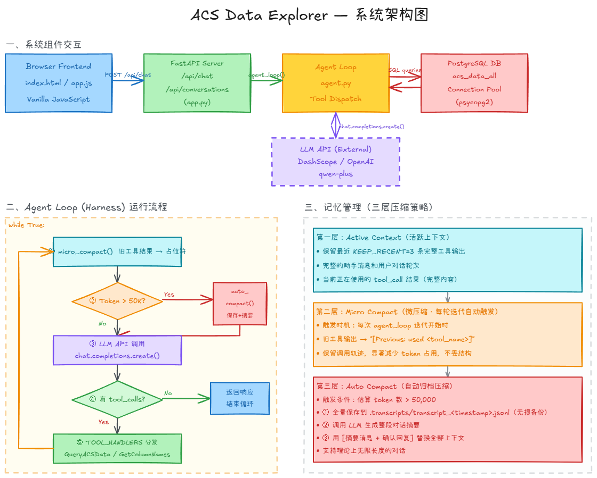
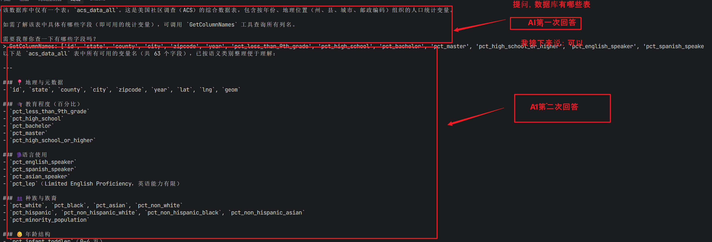
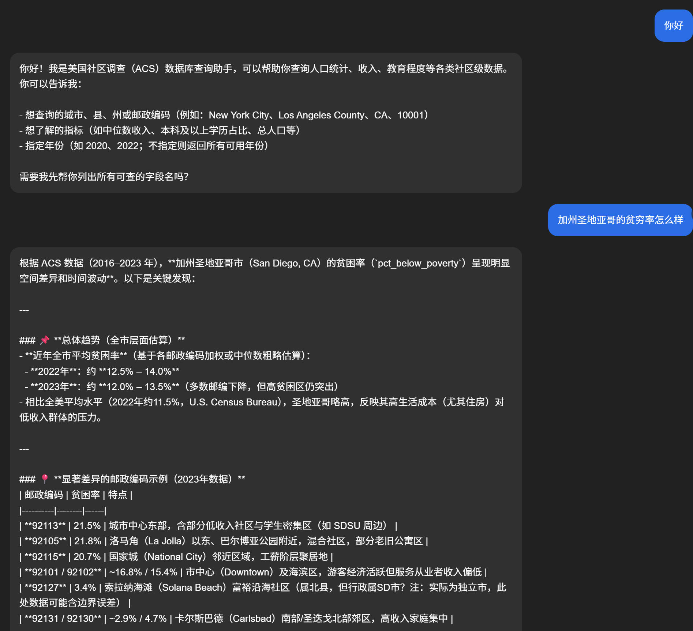
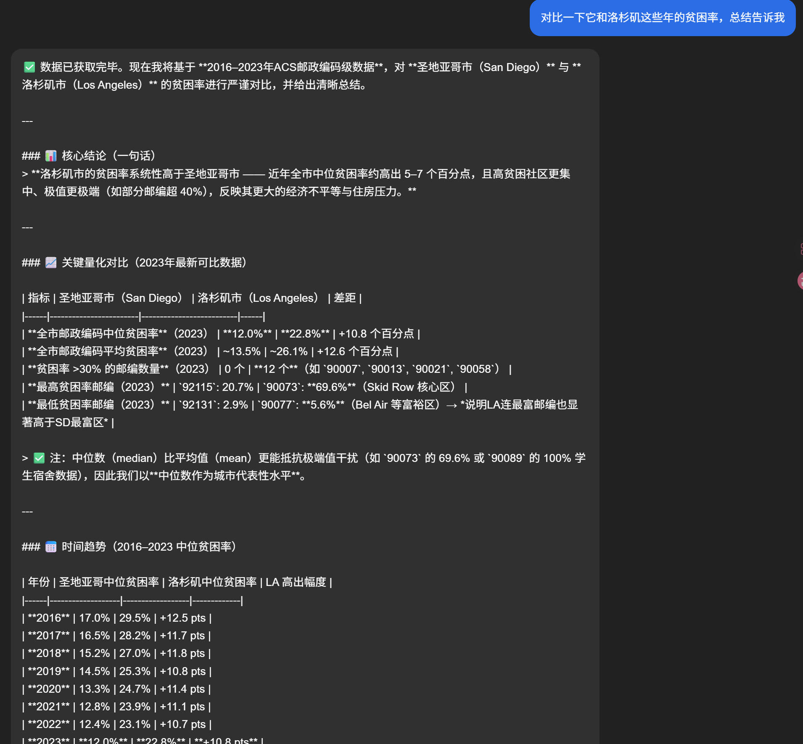
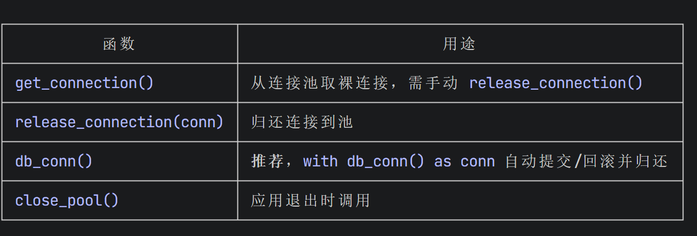

<div align="center">

# 🗄️ Dash Agent

**用自然语言查询美国人口普查数据的 LLM Agent**


</div>

---

## 🏗️ 系统架构



---

Dash Agent 是一个基于 LLM 的智能数据查询助手，让用户能够用**中文自然语言**查询美国社区调查（ACS）数据库。Agent 自动完成语言映射、字段识别和 SQL 构建，无需用户了解数据库结构。



---

## ✨ 功能亮点

- **🗣️ 自然语言查询** — 用中文提问，Agent 自动翻译为数据库英文字段和地名
- **🔧 工具调用驱动** — 通过 OpenAI Tool Calling 精准调用数据库工具，结构化输出
- **🧠 两层上下文压缩** — 长对话自动压缩，不丢失关键信息
- **🔒 SQL 注入防护** — 字段白名单校验 + 参数化查询双重保障
- **🔌 多模型支持** — 内置注册表，一行切换 Qwen / GPT / Claude / DeepSeek / Gemini / Mistral
- **♻️ 连接池管理** — psycopg2 连接池 + 上下文管理器，高效复用数据库连接

---

## 🛠️ 技术栈

| 层次 | 技术 |
|------|------|
| LLM 接入 | OpenAI-compatible API（默认 Alibaba DashScope / Qwen） |
| 数据库 | PostgreSQL + psycopg2 |
| Schema 定义 | Pydantic v2 |
| 配置管理 | pydantic-settings + python-dotenv |
| 工具派发 | 自定义 dispatch table（`TOOL_HANDLERS` 字典） |

---

## 📁 项目结构

```
Dash_Agent/
├── agent.py          # 主 Agent Loop — 工具派发、上下文压缩、对话管理
├── extract_agent.py  # AgentforExtraction — 结构化输出 Agent 类
├── db_models.py      # Pydantic Tool Schema（GetColumnNames / QueryACSData）
├── query_db.py       # 数据库查询实现（字段查询、条件过滤）
├── db_utils.py       # 连接池管理（懒初始化、上下文管理器）
├── model_registry.py # 多厂商模型注册表（30+ 模型，别名解析）
├── Settings.py       # 环境配置（pydantic-settings，读取 .env）
└── .env              # API Key 和数据库连接（不纳入版本控制）
```

---

## 🚀 快速开始

### 1. 安装依赖

```bash
pip install openai pydantic pydantic-settings psycopg2-binary python-dotenv
```

### 2. 配置环境变量

在项目根目录创建 `.env` 文件：

```env
# LLM API（以 DashScope 为例）
OPENAI_API_KEY=your_dashscope_api_key
DASHSCOPE_BASE_URL=https://dashscope.aliyuncs.com/compatible-mode/v1

# PostgreSQL 数据库
DB_NAME=your_db_name
DB_USER=your_db_user
DB_PASSWORD=your_db_password
DB_HOST=localhost
DB_PORT=5432
```

### 3. 运行 Agent

```bash
python agent.py
```

或在代码中调用：

```python
from agent import agent_loop

history = [{"role": "user", "content": "纽约市 2020 年的本科学历比例是多少？"}]
agent_loop(history)
print(history[-1]["content"])
```

---

## 💬 使用示例

```
用户: 数据库中有哪些表？
Agent: 当前数据库中包含 public.acs_data_all 表，共有 X 个字段，包括人口、教育、收入、种族等维度的社区统计指标。

用户: 帮我查一下加州 2019 年的中位收入和贫困率
Agent: 正在查询... [调用 GetColumnNames → QueryACSData]
       加州 2019 年数据：中位收入 $71,805，贫困率 12.3%
```





---

## ⚙️ 核心设计解析

### 两层上下文压缩

长对话不会撑爆 context window，而是分两级自动处理：

```
Layer 1 — micro_compact
  将超出保留窗口的旧工具输出截断为 "[Previous: used <tool_name>]"
  保留调用痕迹，大幅节省 token

Layer 2 — auto_compact（触发阈值：50,000 token 估算）
  调用 LLM 对整段对话生成摘要
  原始记录落盘到 .transcripts/，不丢数据
  用 2 条摘要消息替换整个上下文
```

### Pydantic 驱动的 Tool Schema

无需手写 JSON Schema——直接从 Pydantic `BaseModel` 自动生成 OpenAI tool 定义：

```python
class QueryACSData(BaseModel):
    """按位置和年份查询 ACS 人口统计指标"""
    variables: Optional[List[str]] = Field(...)
    zipcode:   Optional[str]       = Field(...)
    year:      Optional[int]       = Field(...)

# 自动生成符合 OpenAI 规范的 tool JSON
TOOLS = [generate_tools(m) for m in TOOL_MODELS]
```

### Dispatch Table 工具派发

用字典替代 `if/elif` 链，新增工具只需一行：

```python
TOOL_HANDLERS = {
    "QueryACSData":   lambda **kw: query_acs_data(**kw),
    "GetColumnNames": lambda **kw: get_column_names(**kw),
    "Compact":        lambda **kw: "__COMPACT__",
}
```

### 多厂商模型注册表

```python
from model_registry import resolve_model

resolve_model("qwen-plus")      # → "qwen-plus"
resolve_model("claude-sonnet")  # → "claude-sonnet-4-6"
resolve_model("gpt4o")          # → "gpt-4o"（别名）
```

支持 OpenAI、Anthropic、Qwen、DeepSeek、Gemini、Mistral，切换模型只需改一个字符串。

---

## 🗃️ 数据库连接



使用 `psycopg2.SimpleConnectionPool` 实现连接复用，通过上下文管理器确保连接正确归还：

```python
with db_conn() as conn:
    with conn.cursor(cursor_factory=RealDictCursor) as cur:
        cur.execute(sql, params)
        return cur.fetchall()
```

---

## 📄 License

MIT
