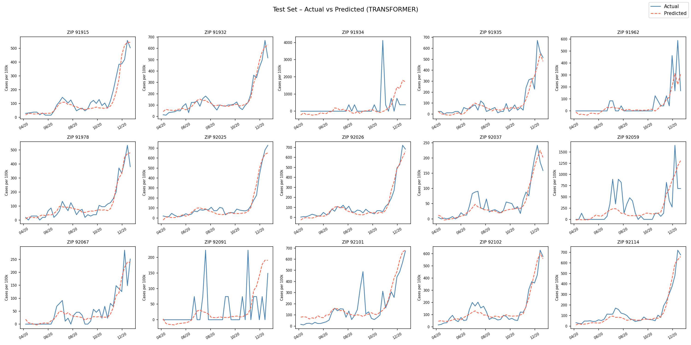

<div align="center">

# PRISM Model
### Pandemic Response Inference via Sequence Modeling

**Predicting weekly COVID-19 case trajectories from mobility patterns and socioeconomic structure**

[](https://python.org)
[](https://pytorch.org)
[](https://developer.nvidia.com/cuda-zone)

</div>

---


*Transformer predictions vs. actual COVID-19 weekly case rates across 15 held-out ZIP codes*

---

## Overview

PRISM takes a **dual-stream approach**: mobility signals (dynamic, week-by-week) are processed by a temporal encoder while socioeconomic context (static, per-ZIP) is encoded by an MLP. The two streams are fused and decoded into a full COVID sequence at once — no autoregressive rollout needed.

```
Given:  38 weeks of mobility data  +  15 socioeconomic features  →  Predict: 38 weeks of COVID cases
```

---

## Project Structure

```
PRISM_Model/
├── config.py           ← single source of truth for all settings
├── preprocess.py       ← data pipeline (merge → split → normalize)
├── loader.py           ← PyTorch Dataset / DataLoader
├── model.py            ← LSTM & Transformer architectures
├── main.py             ← training loop
├── predict.py          ← inference + 3×5 visualization grid
│
├── data/
│   ├── raw/
│   │   ├── acs_yearly.csv          ACS annual socioeconomic data by ZIP
│   │   └── train_data.csv          Weekly mobility + COVID case data
│   ├── X_train_scaled.csv / X_test_scaled.csv
│   ├── y_train_scaled.csv / y_test_scaled.csv
│   ├── y_train_stats.csv           per-ZIP mean/std for inverse transform
│   └── y_test_stats.csv
└── checkpoints/
    ├── best_lstm.pt
    └── best_transformer.pt
```

---

## Data Pipeline

### Step 1 — Merge `merge_acs_with_train`

ACS data is annual; mobility/COVID data is weekly. They are joined on `(zipcode, year)` — ACS values are broadcast to every week within that year.

```
acs_yearly.csv  ──┐
                  ├── join on (zipcode, year) ──► data.csv
train_data.csv  ──┘
```

### Step 2 — Split `split_train_test`

Split is done **at ZIP code level** so each ZIP's complete 38-week time series stays intact in one partition.

| Split | ZIPs | Weeks per ZIP | Total rows |
|-------|------|---------------|------------|
| Train | 83 (85%) | 38 | 3,154 |
| Test  | 15 (15%) | 38 | 570 |

ZIPs are randomly shuffled before splitting (`seed=42`).

### Step 3 — Feature Selection `prepare_features`

| Stream | Columns | Role |
|--------|---------|------|
| Dynamic (mobility) | 3 | Time-varying weekly signal |
| Static (ACS) | 15 | Fixed socioeconomic context per ZIP |
| Target | `Weekly_New_Cases_per_100k` | What we predict |

### Step 4 — Normalization `normalize_features`

Two strategies, one for each stream:

> **Features X → cross-ZIP z-score**
> Captures how each ZIP compares to others. Uses the distribution of per-ZIP means across all ZIPs.
> ```
> z = (x − mean_of_ZIP_means) / std_of_ZIP_means
> ```

> **Target y → within-ZIP z-score**
> Each ZIP is normalized independently so the model learns the **shape** of the epidemic curve, not the absolute magnitude.
> ```
> z = (y − mean_ZIP) / std_ZIP
> ```
> Per-ZIP stats saved to `y_{train,test}_stats.csv` for inverse-transform at prediction time.

---

## Data Dimensions

Each ZIP code is **one sample** — the batch dimension indexes over ZIPs, not time.

```
Single sample:
  x_dyn    →  (T=38, F=3)     mobility time series
  x_static →  (F=15,)         ACS features (same for all 38 steps)
  y        →  (T=38, 1)       COVID cases per 100k

Batched (B ZIPs):
  x_dyn    →  (B, 38, 3)
  x_static →  (B, 15)
  y        →  (B, 38, 1)
```

<details>
<summary>Feature names</summary>

**Dynamic — 3 mobility features**
| Feature | Description |
|---------|-------------|
| `median_non_home_dwell_time_lag4` | Time spent away from home (4-week lag) |
| `non_home_ratio_lag4` | Ratio of non-home activity (4-week lag) |
| `full_time_work_behavior_devices_lag4` | Full-time work mobility signal (4-week lag) |

**Static — 15 ACS socioeconomic features**
`pct_less_than_9th_grade` · `pct_lep` · `pct_hispanic` · `pct_non_hispanic_black` · `pct_senior` · `pct_young_adults` · `pct_below_poverty` · `pct_unemployed` · `pct_uninsured` · `per_capita_income` · `pct_female_headed_households` · `pct_overcrowded_housing` · `pct_households_without_a_vehicle` · `pct_work_at_home` · `pct_service`

</details>

---

## Model Architecture

Both models share the same **dual-stream → fusion → decode** design.

### LSTM

```
 x_dyn (B,T,3)              x_static (B,15)
       │                           │
  ┌────▼────┐                ┌─────▼─────┐
  │  LSTM   │                │    MLP    │
  │ 3→H, L  │                │  15→Hs   │
  └────┬────┘                └─────┬─────┘
       │                           │  unsqueeze + expand
  (B,T,H)                     (B,T,Hs)
       │                           │
       └──────── concat ───────────┘
                    │
              (B, T, H+Hs)
                    │
              Linear → (B,T,1)
```

### Transformer

```
 x_dyn (B,T,3)              x_static (B,15)
       │                           │
  Linear(3→d)               ┌─────▼─────┐
       │                     │    MLP    │
  Positional Enc             │  15→Hs   │
       │                     └─────┬─────┘
  ┌────▼──────────┐                │  unsqueeze + expand
  │  Transformer  │           (B,T,Hs)
  │  Encoder ×L   │
  └────┬──────────┘
  (B,T,d_model)                    │
       │                           │
       └──────── concat ───────────┘
                    │
              (B, T, d_model+Hs)
                    │
              Linear → (B,T,1)
```

---

## Configuration

All settings live in `config.py`. Change `"model"` to switch architectures.

### Shared Parameters

| Parameter | Value | Description |
|-----------|:-----:|-------------|
| `dropout` | `0.1` | Dropout rate |
| `static_hidden_size` | `32` | ACS MLP hidden dim `Hs` |
| `num_layers` | `1` | Encoder depth |
| `batch_size` | `16` | ZIPs per batch |
| `lr` | `1e-3` | Adam learning rate |
| `weight_decay` | `1e-3` | L2 regularization |
| `epochs` | `100` | Max training epochs |
| `patience` | `150` | Early stopping patience |

### LSTM

| Parameter | Value | Description |
|-----------|:-----:|-------------|
| `hidden_size` | `256` | Hidden state dim `H` |
| `bidirectional` | `False` | Uni-directional |

### Transformer

| Parameter | Value | Description |
|-----------|:-----:|-------------|
| `d_model` | `128` | Embedding dim |
| `nhead` | `4` | Attention heads |
| `dim_feedforward` | `128` | FFN hidden dim |

---

## Results

| Model | Train R² | Test R² | Params |
|-------|:--------:|:-------:|-------:|
| LSTM | 0.74 | 0.58 | ~270K |
| **Transformer** | **0.82** | **0.68** | ~100K |
| RandomForest | 0.64 | 0.42 | - |

---

## Quick Start

```bash
# 1. Prepare all data (run once)
python preprocess.py

# 2. Train  —  edit config.py to switch lstm ↔ transformer
python main.py

# 3. Visualize predictions on test ZIPs
python predict.py          # → predict_{model}.png
```
