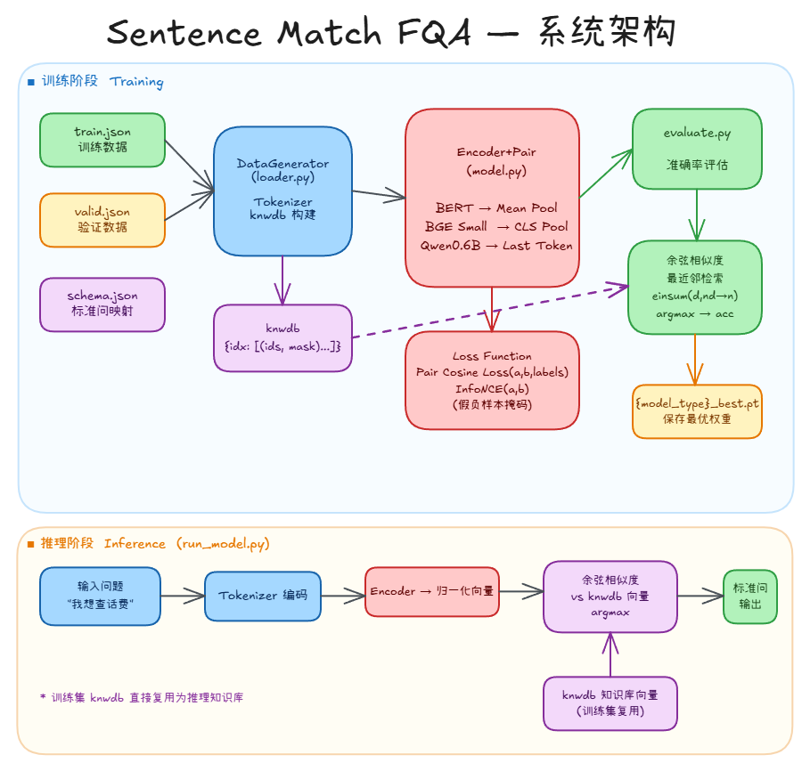
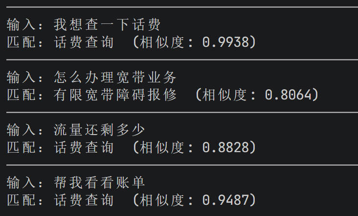

<div align="center">

# 🔍 Sentence Match FQA

**基于对比学习的中文 FAQ 语义匹配系统**

*支持 BERT / BGE / Qwen3-Embedding 三类预训练模型，单配置项一键切换，无分类头纯向量检索*

---


</div>

---

## 📌 项目简介

本项目构建了一套完整的中文 FAQ 语义匹配系统，面向客服、知识库等场景，将用户输入的自然语言问题映射到标准问题库中最匹配的条目。

系统的核心思路是**对比学习 + 向量检索**：训练阶段让相同语义的问题在向量空间中更近，推理阶段通过余弦相似度最近邻匹配找到标准问——**没有分类头，评估方式与线上部署完全一致**。

项目同时集成了三种不同架构的预训练模型，形成完整的对比实验平台。

---

## 🏆 实验结果

在电信客服 FAQ 数据集（**29 类标准问题，464 条验证样本**）上的准确率对比：

| 模式 | 模型 | 是否微调 | 准确率 |
|---|---|---|---|
| `qwen_finetune` | Qwen3-Embedding-0.6B | ✅ InfoNCE 微调 | **97.2%** |
| `bge_finetune` | BGE-small-zh-v1.5 | ✅ InfoNCE 微调 | 93.97% |
| `qwen_infer` | Qwen3-Embedding-0.6B | ❌ 零样本 | 93.1% |
| `bert` | bert-base-chinese | ✅ Pair Cosine 微调 | 92.0% |
| `bge_infer` | BGE-small-zh-v1.5 | ❌ 零样本 | 91.8% |

> Qwen3 和 BGE 的零样本基线均超过 91%，展示了强大的预训练泛化能力；微调后 Qwen3 进一步提升至 97.2%。

---

## 🖼️ 系统架构



---

## ✨ 技术亮点

### 1. 五种模式，一行切换

只需修改 `config.py` 中的一个字段，即可在五种运行模式之间无缝切换：

```python
Config = {
    "model_type": "qwen_finetune",  # bert | bge_infer | bge_finetune | qwen_infer | qwen_finetune
    ...
}
```

`main.py`、`evaluate.py`、`loader.py` 对 `model_type` 完全透明——切换成本为零，方便横向对比各模型方案的效果。

---

### 2. 三种 Pooling 策略，对应三类模型架构

不同预训练模型有不同的最优 pooling 方式，项目针对各自架构特点分别实现：

```
BERT  (encoder-only, 双向注意力)
  → Mean Pooling：对所有非 PAD token 的隐状态加权平均

BGE   (encoder-only, 对比预训练)
  → CLS Pooling：取第 0 个 token 的隐状态，与预训练目标一致

Qwen3 (decoder-only, 因果注意力)
  → Last-Token Pooling：取最后一个真实 token 的隐状态
  → Tokenizer 强制左填充，确保 batch 末位始终是真实 token
```

---

### 3. InfoNCE 假负样本掩码

In-batch InfoNCE 训练时，同一 batch 内可能出现来自同一标准问的两个样本——它们语义上是正样本，但会被 InfoNCE 错误地当作负样本惩罚。

数据集仅 29 类、batch_size=32，**不处理时每个 batch 必然命中同类冲突**。项目通过同类掩码解决：

```python
# 同类非对角位置 → 相似度置为 -inf → softmax 权重归零 → 不产生梯度
same_class = class_labels.unsqueeze(1) == class_labels.unsqueeze(0)   # (B, B)
false_negative_mask = same_class & ~torch.eye(B, dtype=torch.bool)
sim_matrix = sim_matrix.masked_fill(false_negative_mask, float("-inf"))
```

---

### 4. 知识库即训练集的双重复用

训练集所有问题在加载时构建成 `knwdb` 字典，在项目中承担两个完全不同的职责：

```
训练时  → 正/负样本采样池（正样本 = 同一 idx 下随机取两个问题）
评估时  → 编码为向量矩阵，作为最近邻检索的向量数据库
```

无需额外的索引构建步骤，训练集天然就是检索库。

---

### 5. 无分类头的向量检索评估

评估不依赖 softmax 分类头，直接用余弦相似度最近邻检索：

```python
test_vec = F.normalize(test_vec, dim=-1)                             # (H,)
similarities = torch.einsum("d,nd->n", test_vec, self.knwbd_vectors) # (N,)
hit_idx = torch.argmax(similarities).item()
```

这与实际生产部署方式完全一致，评估指标直接反映线上效果。

---

## 🚀 快速上手

### 环境依赖

```bash
pip install torch transformers
```

### 下载预训练模型

| 模型 | 来源 |
|---|---|
| bert-base-chinese | HuggingFace / 本地 |
| BAAI/bge-small-zh-v1.5 | HuggingFace / 本地 |
| Qwen/Qwen3-Embedding-0.6B | HuggingFace / 本地 |

在 `config.py` 中配置各模型的本地路径：

```python
MODEL_DIR = Path("your/model/dir")

Config = {
    "model_type"     : "qwen_finetune",          # 切换此处即可
    "model_path"     : MODEL_DIR / "bert" / "bert-base-chinese",
    "bge_model_path" : MODEL_DIR / "BAAI" / "bge-small-zh-v1.5",
    "qwen_model_path": MODEL_DIR / "Qwen" / "Qwen3-Embedding-0.6B",
    ...
}
```

### 训练

```bash
python main.py
```

训练过程自动评估，最优 checkpoint 保存至 `output/{model_type}_best.pt`。

### 推理

```bash
python run_model.py
```



---

## 📁 项目结构

```
Sentence_Match_FQA/
├── config.py          # 全局配置（模型路径、训练超参、模式切换）
├── model.py           # BERT / BGE / Qwen 模型封装 + Loss 函数
├── loader.py          # 数据加载、Tokenizer、knwdb 构建
├── main.py            # 训练主程序（含多模型对比实验循环）
├── evaluate.py        # 向量检索评估器
├── run_model.py       # 推理脚本（加载权重 → 最近邻匹配）
├── data/
│   ├── train.json     # 训练集（问题 → 标准问索引）
│   ├── valid.json     # 验证集
│   └── schema.json    # 标准问文本 → 整数索引映射
└── output/            # 训练产出（best.pt、实验结果 CSV）
```

---

## 📊 配置参数说明

| 参数 | 默认值 | 说明 |
|---|---|---|
| `model_type` | `qwen_finetune` | 五种模式之一 |
| `max_length` | `20` | Tokenizer 最大编码长度 |
| `epoch` | `10` | 训练轮数 |
| `batch_size` | `32` | 批大小 |
| `learning_rate` | `2e-5` | AdamW 学习率 |
| `positive_sample_rate` | `0.45` | 训练对中正样本比例（BERT 模式） |

---

<div align="center">

*如有问题或建议，欢迎提 Issue。*

</div>
